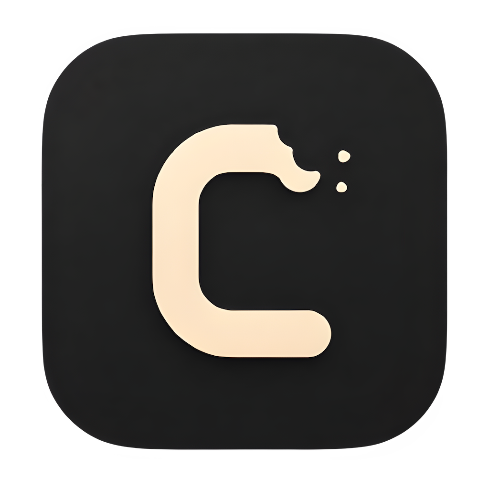

<div align="center">



# Crave

**A native desktop recipe manager, written from scratch in C.**

[](https://github.com/bichanna/crave/actions/workflows/ci.yaml)


</div>

Offline, single-window, monochrome. Recipes — ingredients, steps, tags, a photo —
stored locally in SQLite. No browser, no Electron, no cloud. The whole UI is drawn
with [Clay](https://github.com/nicbarker/clay) + [raylib](https://www.raylib.com/),
structured as [The Elm Architecture](https://guide.elm-lang.org/architecture/) in C.
Fonts are embedded, so it ships as one self-contained binary.

## Building

### Requirements

- **Meson** and **Ninja** — the build system.
- **Python 3** — runs at build time to embed the fonts into the binary.
- A **C compiler** — GCC or Clang on Linux/macOS, MinGW GCC on Windows.

The raylib static libraries for all three platforms are already vendored under
`thirdparty/raylib/`, so there is nothing else to download.

### Linux

```sh
# Debian/Ubuntu: build tools + the X11/OpenGL dev libraries raylib links against
sudo apt install build-essential meson ninja-build python3 \
  libgl1-mesa-dev libx11-dev libxrandr-dev libxinerama-dev libxcursor-dev libxi-dev

git clone https://github.com/bichanna/crave
cd crave

just build                # or: meson setup build && meson compile -C build
./build/crave
```

On Fedora the dev libraries are `mesa-libGL-devel libX11-devel libXrandr-devel
libXinerama-devel libXcursor-devel libXi-devel`
On Arch, the `libx11 libxrandr
libxinerama libxcursor libxi mesa` packages.

### macOS

```sh
xcode-select --install    # C compiler, if you don't already have it
brew install meson ninja

git clone https://github.com/bichanna/crave
cd crave

just build                # or: meson setup build && meson compile -C build
./build/crave
```

### Windows (MinGW)

Build from an **MSYS2 MINGW64** shell — the vendored Windows lib is a MinGW build,
so the MinGW toolchain is required (MSVC won't link against it).

```sh
# in the MSYS2 MINGW64 shell
pacman -S mingw-w64-x86_64-gcc mingw-w64-x86_64-meson \
          mingw-w64-x86_64-ninja mingw-w64-x86_64-python

git clone https://github.com/bichanna/crave
cd crave

meson setup build && meson compile -C build
./build/crave.exe
```

### Release build

```sh
just release && meson compile -C build      # optimized, no debug info
# or: meson setup build --buildtype=release && meson compile -C build
```

Run the binary from anywhere — recipes and images are stored in a per-user data
directory (see [Data](#data)), not next to the executable.

## Package a macOS app

```sh
./scripts/package_macos.sh   # -> dist/Crave.app and dist/Crave.dmg
```

## License

[Apache-2.0](LICENSE).
